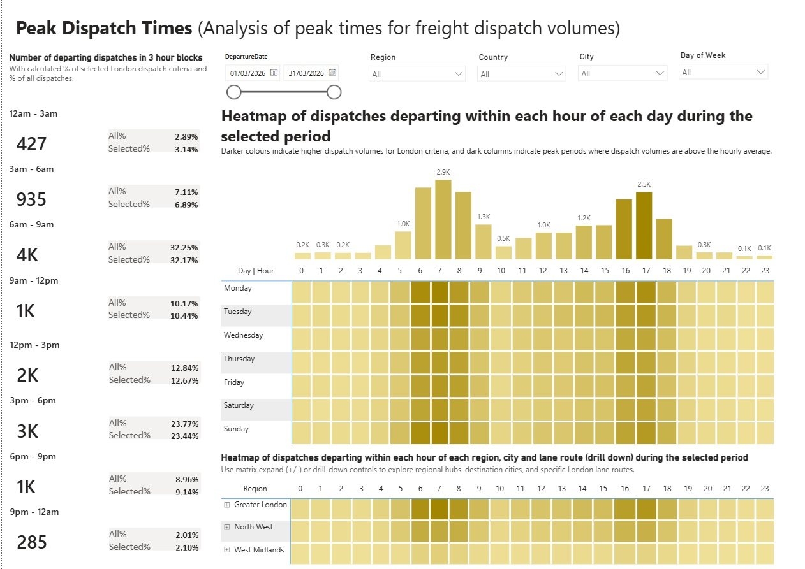

# Freight Peak Travel Times Dashboard 🚚📊

An interactive Power BI analytics dashboard built to analyse peak freight dispatch times, hourly departure trends, and regional capacity across time blocks, regional hubs, and destination cities.

## 🗂️ Data Dictionary & Star Schema

* **`fact_shipments`**: Main transactional table containing `ShipmentID`, `DepartureDate`, `DepartureHour`, `TimeBlock_3HR`, `TimeBlock_Sort`, and dispatch metrics.
* **`dim_location`**: Geolocation hierarchy (`Region`, `Country`, `City`, `LocationID`).
* **`dim_services`**: Service levels and transport modes (`ServiceTier`, `TransportMode`).
* **`dim_lane`**: Origin and destination route identifiers (`LaneName`, `OriginLocationID`, `DestinationLocationID`).
